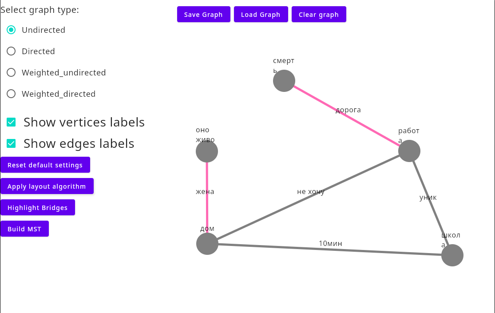

# 🧩 Graph Desktop Application

## 📘 Overview

— это десктопное приложение для визуализации и анализа графов, написанное на **Kotlin** с использованием **Jetpack Compose Desktop** и архитектуры **MVVM**.

---

## ⚙️ Features

| Функция | Описание |
|:--------|:----------|
| **Добавление вершин** | ПКМ на холсте → ввод имени вершины |
| **Добавление рёбер** | Клик по первой вершине → клик по второй → ввод имени и веса ребра |
| **Перемещение** | Перетаскивание мышью |
| **Отображение подписей** | Переключатели “Show vertices/edges labels” |
| **Сброс настроек** | Возврат к исходным цветам и положениям |
| **Сохранение / загрузка** | JSON-файлы графа |
| **ForceAtlas2 Layout** | Раскладка графа на плоскости |
| **Find Bridges** | Поиск мостов в графе |
| **Minimum Spanning Tree (Kruskal)** | Построение рёбер MST для взвешенного графа |

---

## 📄 Лицензия
[MIT](https://choosealicense.com/licenses/mit/)
